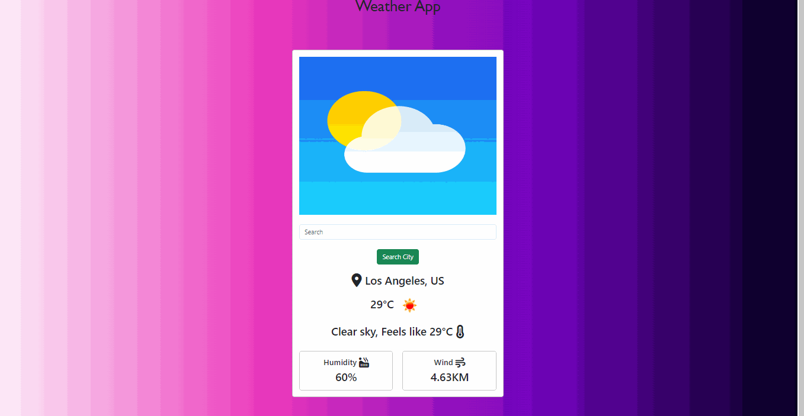

# Weather App

Aplicación web que muestra en tiempo real el clima de las diferentes ciudades del mundo por medio del consumo de una API, la aplicación cuenta con un formulario donde el usuario ingresa la ciudad y mostrará informacion relevante del clima. 

## Tecnologías usadas

 ● Python versión 3.8.5
 
 ● Framework Django versión 4.2.5
 
 ● Bootstrap versión 5.3

 ● CSS

## Instalación
1. Clona este repositorio: `https://github.com/AndresSilverall/Weather-app.git`
2. Navega a la carpeta del proyecto: `cd Weather-app`
3. Ejecuta un entorno virtual de Python: 

 ● `python -m venv venv`

 ● `cd venv`

 ● `cd Scripts`

 ● `activate`

4. Una vez ya activado el entorno virtual, desde la carpeta raiz del proyecto instalar todas las dependencias de la aplicación con `pip install -r requirements.txt`
5. Ejecuta el servidor de desarrollo: `python manage.py runserver`
6. Abre tu navegador y ve a: `http://127.0.0.1:8000/`

## App en ejecución

 
